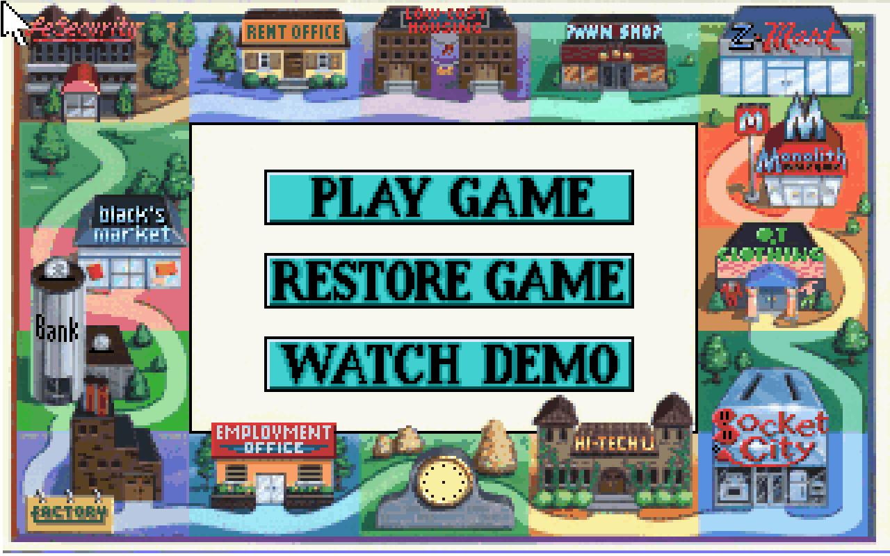
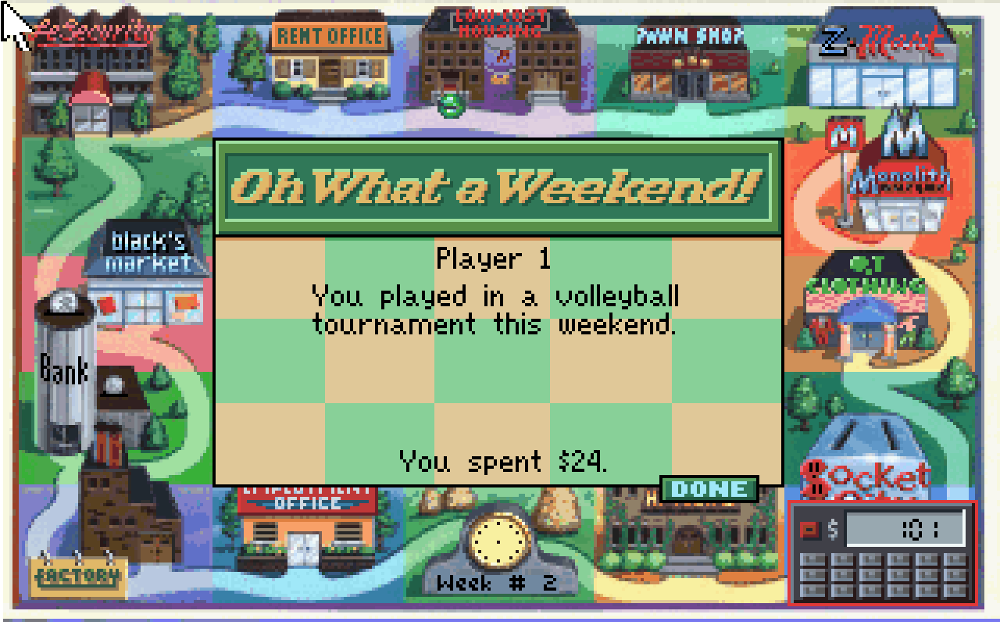

# Browser verification — 2 October 2026

The delivered browser runs the original English Jones DOS 1.000.060 resource files through a source-built SCI-only ScummVM WebAssembly interpreter. The browser shell has no replacement gameplay model. Verification below distinguishes unchanged game data from observed runtime behavior.

## Data integrity

- All 22 original files match `reports/original_files.sha256`.
- 69 unchanged low-level scripts reassemble byte-identically.
- 752 exported graphic cels and their transparency are covered by the existing data tests.
- All seven original PIC images and 36 selected VIEW exports reproduce exactly from the original resources.
- The combined Python suite passes 28 tests.
- `tools/fetch_scummvm_web.py --verify` verifies every delivered runtime file against its manifest.
- `tools/build_browser.py` verifies the runtime and original game data before packaging. The ZIP is checked for corruption after creation.

## Browser evidence

**17/17 checks passed** in Chromium 149.0.7827.55, using actual mouse/keyboard input, original rendered screens and read-only file inspection. The final run took 3 minutes 38 seconds and recorded 45 screenshots. [Full runtime report](browser_runtime.json).

- Original English startup, main menu, one-player setup, characters and goals.
- Fullscreen at startup, explicit exit/re-entry and resize; correct 8:5 canvas/visible bounds at 1280×800, 1280×720 and 390×844.
- Original bank deposit/withdrawal, F5 Save and F7 Restore; recorded cash returned to its saved value.
- A fresh original game in the same isolated browser profile exercised Cook application, two paid shifts, a food purchase, paid Hi-Tech U enrollment, a Trade School lesson and Week #2 with its original weekend event. This separate playthrough avoids random bank robbery making later purchase assertions depend on luck; no random event or game rule is disabled.
- Closing/reopening the page restored the same SCI save bytes from IndexedDB. Clicking the original RESTORE GAME menu returned to the saved bank/Week #1/cash $200 state.
- Four original character/goal setups and a four-player game start.
- Challenge Jones → YES → all three original difficulty choices; selecting PLAY FAIR reached JONES' GOALS. This verifies the setup path, not a completed AI turn.
- All four mounted game-resource files remained byte-identical before/after gameplay. No uncaught page errors, failed requests or external requests occurred.

The tested final WebAssembly SHA-256 is `cdc921d43386805dd24050a4ba3abdb171918b91ad8f3eaa4c08546167288020`. The distribution manifest in the runtime report was checked against every packaged file.

Non-fatal interpreter warnings remain: unavailable optional translations/TTS voices/GUI icons, the browser's ScriptProcessor deprecation, and the previously observed `Attempt to free Hunk... Invalid segment type 9!` on restore. Restore displayed the expected saved state; this is not a claim that long-term restore stability is exhaustively proven.

The optional compositor was tested against the real WebAssembly game, including the Sierra/Jones title and original main menu. Modern and CRT display actual live frames. A real click on PLAY GAME through the overlay opens the original How Many Players? screen. Forced loss of the optional overlay context returns to the original game canvas, and restoring the context resumes CRT. The tested 2160p output is 3456 × 2160, preserving the original 8:5 proportions. No uncaught browser error occurred in this isolated display test.

Additional evidence is retained in:

- [Display and failure handling](browser_display.json): real original frames in Modern/CRT, input through the overlay, context-loss fallback, and visible startup errors for unavailable WebGL/storage. These isolated display tests predate the final save-catalog-only engine fix; their exact tested hashes are recorded.
- [Original save compatibility](browser_save_review.json) and [independent persistence run](browser_persistence.json): original F5/F7 and the original RESTORE GAME menu after closing/reopening a page. The final runtime successfully restores the saved bank state. No startup save-slot override was used.
- [Digital audio](browser_audio.json): 48 kHz stereo WebAudio from the original AdLib opening music, 323 measured buffers (285 non-silent), RMS 0.039 and peak 0.320, with no page errors. This measures actual engine output, not physical speaker playback. The audio test used the immediately preceding runtime; the only subsequent engine change was the save-list fix.
- [Local package integrity](browser_package.json): all 40 ZIP members are byte-identical to `build/browser`, all manifest hashes match, and the ZIP CRC check passes. Archive timestamps can differ between local and CI packaging; the contained file hashes are recorded in `build-manifest.json`.

## Scope

These are targeted checks, not an exhaustive equivalence proof against the original DOS interpreter. Long games, every random event, all opponent difficulties, every multiplayer outcome, all hardware/browser combinations, and physical audio playback have not been exhaustively tested. Display resolution and shaders do not create replacement HD artwork. Saved games use ScummVM's format and browser-origin storage; DOS-save interchange is not claimed.

Earlier independent native interpreter evidence is in [ORIGINAL_RUNTIME.md](../docs/ORIGINAL_RUNTIME.md). It predates browser integration fixes and has its own explicit limitations.

## Published delivery

Published from source commit `2279d2e9a14ca8d0872cf6077aa2dc3833fa7f45` to [the playable site](https://tombonator3000.github.io/Jonesinthefastlane/).

- [Browser verification and Pages deployment](https://github.com/Tombonator3000/Jonesinthefastlane/actions/runs/36977069016): **success**, including all 17 browser checks in Chromium **151.0.7922.34**. The artifact `browser-evidence` contains the complete CI report and screenshots.
- [Workbench checks](https://github.com/Tombonator3000/Jonesinthefastlane/actions/runs/36977069008): **success**, including the 28 data tests.
- [Deployment record](browser_deployment.json) and [live-site verification](browser_live.json): all **39 hosted files** match the tested distribution manifest. The live HTTPS site starts in fullscreen with the original 1280×800 display in the test viewport, no uncaught browser errors and no failed requests. The actual live main menu was inspected visually.

